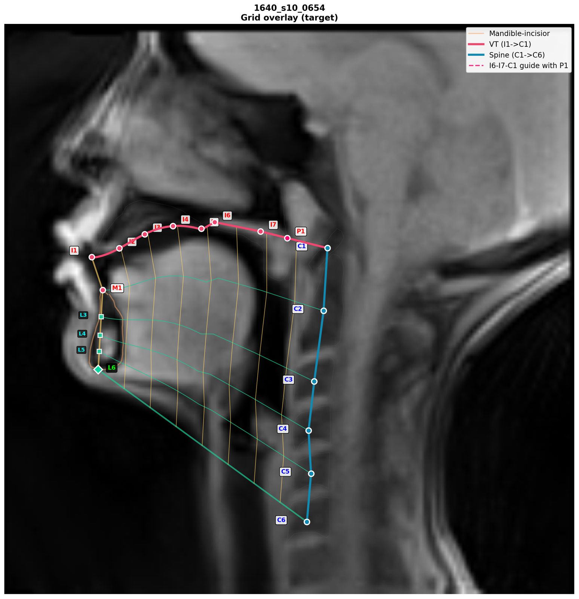
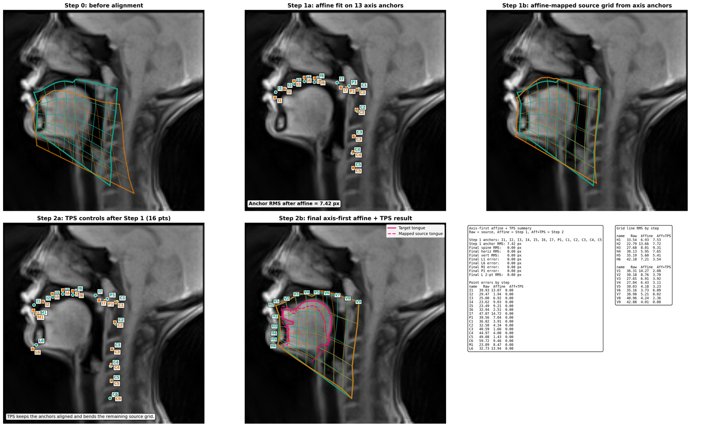
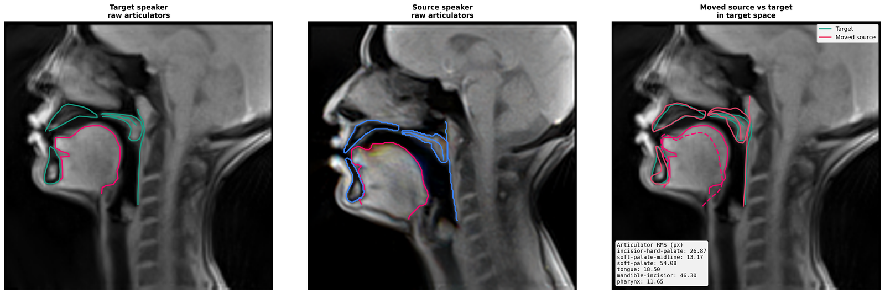
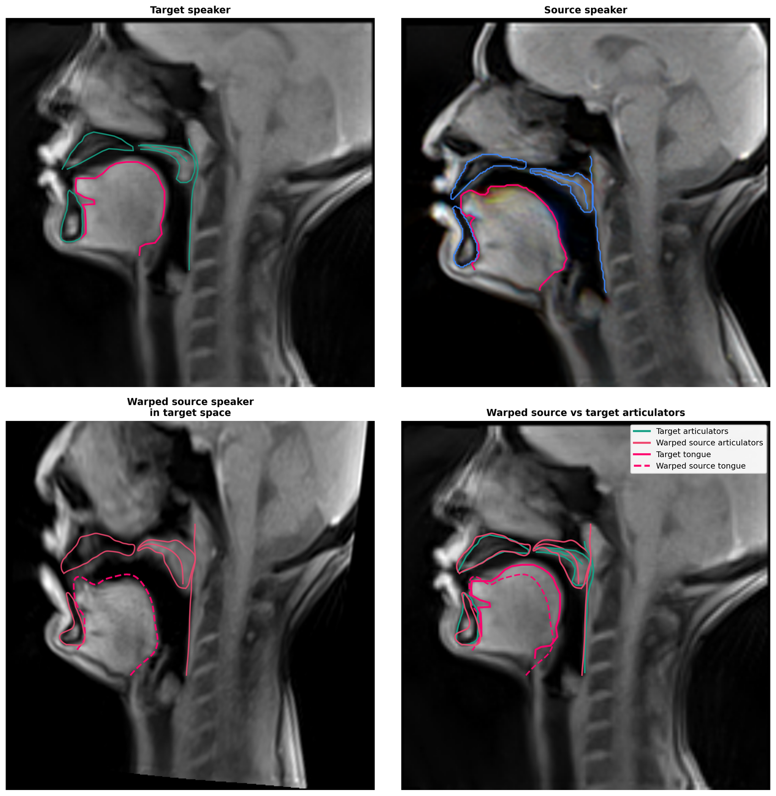
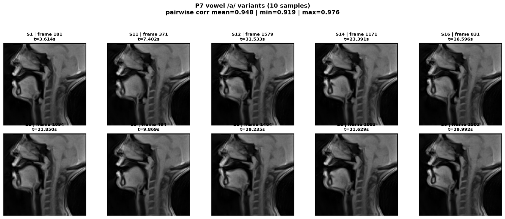
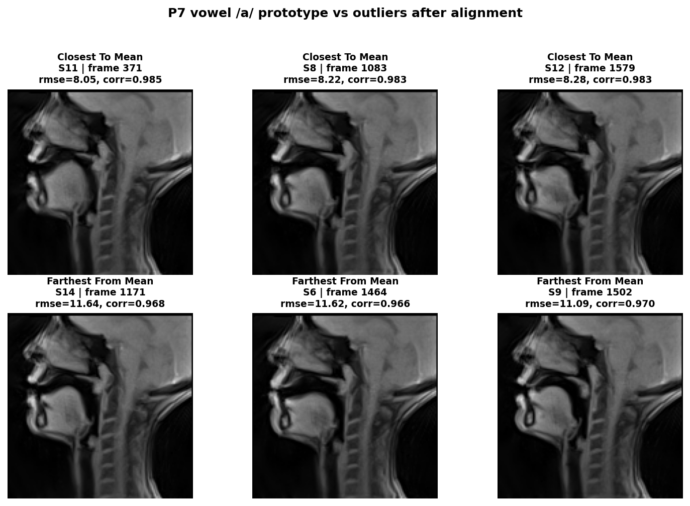

# Grid Transform

Research utilities for building vocal-tract grids, aligning speakers with `Affine + TPS`, and testing transfer hypotheses across VTNL references, segmentation targets, and ArtSpeech sessions.

The repo is organized for reproducible experiments rather than a packaged library. Reusable logic lives in `grid_transform/`, and the canonical command surface lives in `scripts/run/`.

## What This Repo Covers

- Build a landmark-driven grid for a VTNL reference or segmentation target.
- Estimate a two-step `Affine + TPS` transform between a source speaker and a target frame.
- Move articulators or warp the full source image into target space.
- Generate report figures and a PDF summary.
- Project VTNL annotations onto ArtSpeech videos when per-frame ArtSpeech contours are unavailable.
- Warp a full ArtSpeech session into a target frame under a fixed-session annotation assumption.
- Inspect within-speaker and cross-speaker vowel variability from ArtSpeech sessions.

## Repo Layout

- `grid_transform/`
  Shared Python modules, path config, notebook bootstrap, and app entrypoints.
- `scripts/run/`
  Official wrappers for the main workflows.
- `notebooks/`
  Exploration notebooks. Notebook outputs are intentionally not treated as versioned results.
- `experiments/`
  Report generation and side experiment code.
- `docs/`
  Public-facing documentation, data notes, and README assets.
- `VTNL/`
  Lightweight bundled VTNL reference images and ROI zips used by the default examples.
- `vocal-tract-seg/`
  Lightweight bundled target-frame sample data used by the default examples.

Root scripts such as `create_speaker_grid.py` remain available as compatibility shims, but `scripts/run/` is the primary interface.

## Installation

```powershell
python -m venv .venv
.\.venv\Scripts\pip install -r requirements.txt
```

## Data Expectations

The base grid-transform examples run against the bundled sample/reference data in `VTNL/` and `vocal-tract-seg/`.

ArtSpeech session utilities require a separate external dataset root. The expected structure is described in [`docs/DATA.md`](docs/DATA.md). In short, the code expects an ArtSpeech-style speaker layout with:

- `DCM_2D/<session>/` for frame-level DICOM data
- `OTHER/<session>/` for `wav`, `textgrid`, and `trs` session metadata

Large external datasets are not redistributed in this repository.

## Quick Start

### Core Grid Transform Pipeline

```powershell
.\.venv\Scripts\python .\scripts\run\run_create_speaker_grid.py --source vtnl --speaker 1640_s10_0829
.\.venv\Scripts\python .\scripts\run\run_method4_transform.py
.\.venv\Scripts\python .\scripts\run\run_move_target_articulators.py
.\.venv\Scripts\python .\scripts\run\run_warp_source_speaker_to_target.py
```

### Report Generation

```powershell
.\.venv\Scripts\python .\scripts\run\run_generate_report_assets.py
.\.venv\Scripts\python .\scripts\run\run_convert_to_pdf.py
.\scripts\run\build_report.ps1
```

### ArtSpeech Session Utilities

```powershell
.\.venv\Scripts\python .\scripts\run\run_build_artspeech_session_video.py --speaker P7 --session S10 --dataset-root <ARTSPEECH_ROOT>
.\.venv\Scripts\python .\scripts\run\run_project_vtnl_reference_to_artspeech_video.py --target-speaker 1640_s10_0829 --artspeech-speaker P7 --session S10 --dataset-root <ARTSPEECH_ROOT>
.\.venv\Scripts\python .\scripts\run\run_warp_artspeech_session_to_target_video.py --annotation-speaker 1640_s10_0829 --artspeech-speaker P7 --session S10 --target-frame 143020 --dataset-root <ARTSPEECH_ROOT> --output-mode both
```

### Vowel Variability Utilities

```powershell
.\.venv\Scripts\python .\scripts\run\run_extract_all_speakers_vowel_variants.py --dataset-root <ARTSPEECH_ROOT> --samples-per-vowel 10
.\.venv\Scripts\python .\scripts\run\run_extract_speaker_vowel_variants.py --speaker P7 --dataset-root <ARTSPEECH_ROOT> --samples-per-vowel 10
.\.venv\Scripts\python .\scripts\run\run_analyze_aligned_speaker_vowel_variants.py --speaker P7 --samples-per-vowel 10
```

## Results Gallery

### Default Target Grid



### Default Source Grid


### Two-Step `Affine + TPS` Alignment



### Articulators Moved Into Target Space



### Full Source Image Warped Into Target Space



### Same-Speaker Vowel Variants



### Same-Speaker Vowel Prototype vs Outliers After Alignment



## Reproducibility Notes

- Generated outputs live under `outputs/` and are treated as disposable rerun artifacts.
- `docs/assets/github/` contains the curated static images used by this README; it is the only tracked results-like asset folder.
- The ArtSpeech projection workflow uses a fixed image-space resize from a VTNL reference; it is not a contour-derived per-frame warp.
- The full-session ArtSpeech warp also assumes a fixed-session geometry for the source session; it does not estimate new ArtSpeech contours frame by frame.
- Notebooks are exploratory and intentionally kept secondary to the reusable Python modules and wrapper scripts.

## Limitations

- The repo currently assumes specific landmark conventions such as `I1..I7`, `C1..C6`, `M1`, `L6`, and `P1`.
- Several workflows are designed around the bundled example pair: VTNL `1640_s10_0829` and segmentation frame `143020`.
- ArtSpeech analyses rely on external aligned labels and on fixed-session assumptions when full contour annotations are unavailable.

## Release Checklist

See [`docs/release_checklist.md`](docs/release_checklist.md) for a short pre-publish checklist.

## License

This repository is released under the [`MIT License`](LICENSE).
