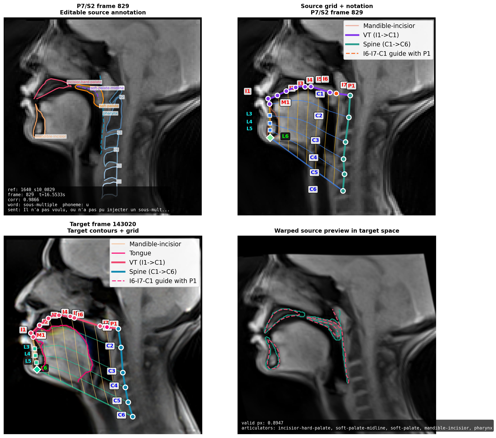
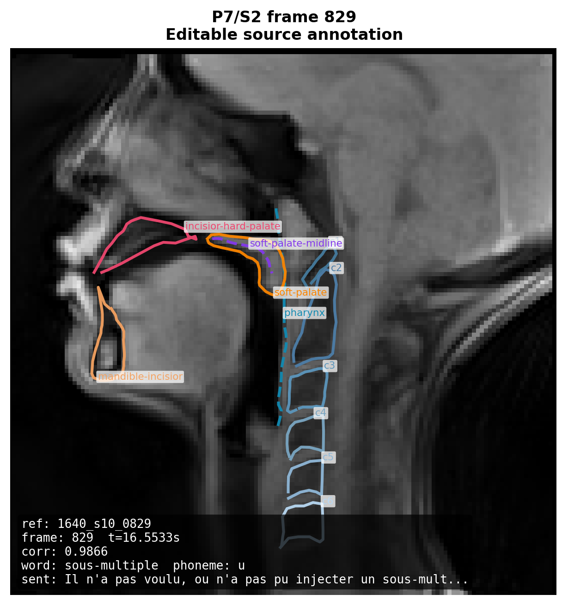
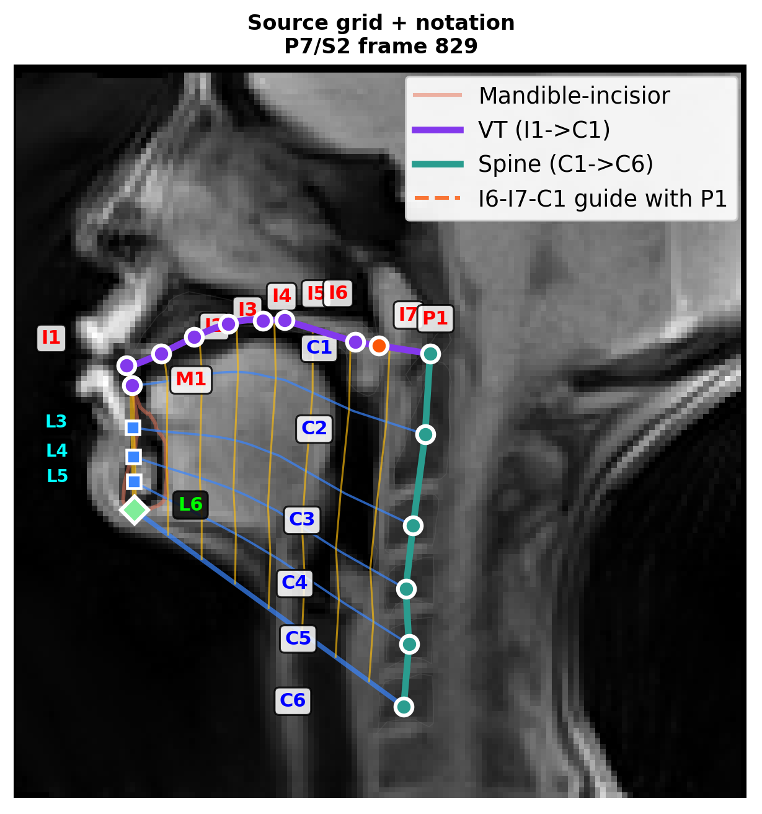
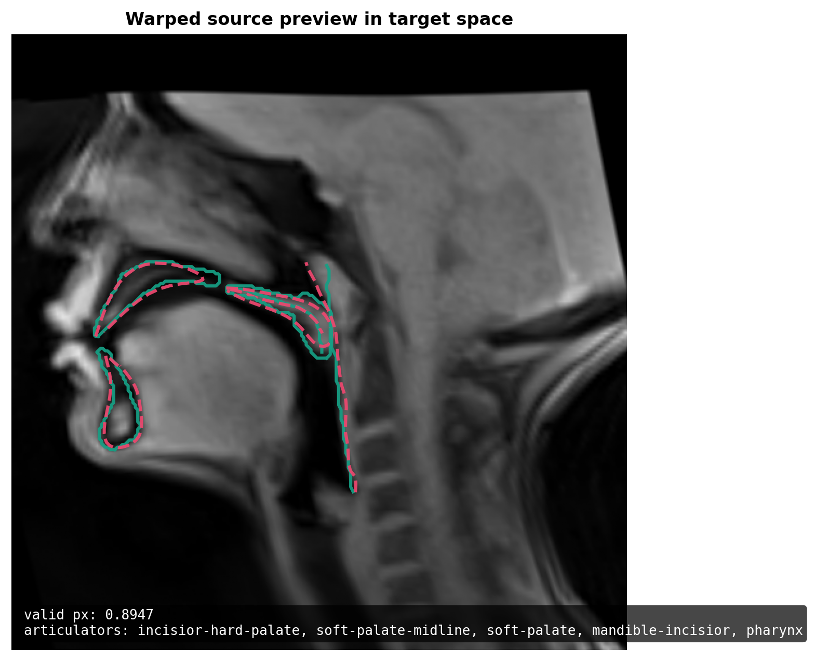
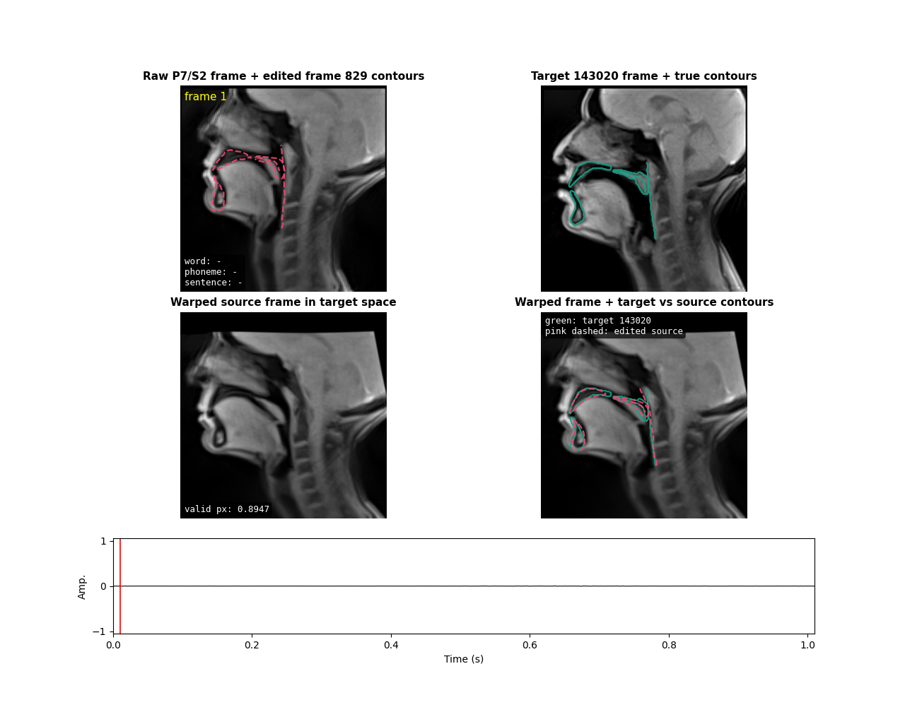

# Grid Transform

Research utilities for building vocal-tract grids, aligning speakers with `Affine + TPS`, and testing transfer hypotheses across VTLN references, segmentation targets, and ArtSpeech sessions.

The repo is organized for reproducible experiments rather than a packaged library. Reusable logic lives in `grid_transform/`, and the canonical command surface lives in `scripts/run/`.

## What This Repo Covers

- Build a landmark-driven grid for a VTLN reference or segmentation target.
- Estimate a two-step `Affine + TPS` transform between a source speaker and a target frame.
- Move articulators or warp the full source image into target space.
- Project VTLN annotations onto ArtSpeech videos when per-frame ArtSpeech contours are unavailable.
- Interactively edit a projected source annotation on an ArtSpeech frame, save it, reuse it for fixed-annotation session warping, and promote the latest saved annotation back into the canonical VTLN defaults.
- Run a multi-step `cv2` workflow to select a curated source speaker, edit source/target annotations, refine affine/TPS landmarks, and launch threaded background export jobs.
- Warp a full ArtSpeech session into a target frame under a fixed-session annotation assumption.
- Inspect within-speaker and cross-speaker vowel variability from ArtSpeech sessions.

## Repo Layout

- `grid_transform/`
  Shared Python modules, path config, notebook bootstrap, and app entrypoints.
- `scripts/run/`
  Official wrappers for the main workflows.
- `notebooks/`
  Exploration notebooks. Notebook outputs are intentionally not treated as versioned results.
- `experiments/`
  Side experiment code and archived research helpers.
- `docs/`
  Public-facing documentation, data notes, and README assets.
- `config.yaml`
  Local default settings for the multi-step `cv2` annotation-to-grid-transform app. CLI flags still override the YAML values.
- `VTLN/`
  Canonical bundled data now lives in `VTLN/data/`, including 480x480 RGB triplet references, scaled ROI zips, and the bundled nnUNet target case.

`scripts/run/` is the canonical interface. Root scripts such as `create_speaker_grid.py` remain available as convenience aliases for older commands.

## Installation

```powershell
python -m venv .venv
.\.venv\Scripts\pip install -r requirements.txt
```

## Data Expectations

The base grid-transform examples run against the bundled sample/reference data in `VTLN/data/`.

ArtSpeech session utilities require a separate external dataset root. The expected structure is described in [`docs/DATA.md`](docs/DATA.md). In short, the code expects an ArtSpeech-style speaker layout with:

- `DCM_2D/<session>/` for frame-level DICOM data
- `OTHER/<session>/` for `wav`, `textgrid`, and `trs` session metadata

Large external datasets are not redistributed in this repository.

## Quick Start

### Core Grid Transform Pipeline

```powershell
.\.venv\Scripts\python .\scripts\run\run_create_speaker_grid.py --source vtln --speaker 1640_P7_S2_F0829
.\.venv\Scripts\python .\scripts\run\run_method4_transform.py
.\.venv\Scripts\python .\scripts\run\run_move_target_articulators.py
.\.venv\Scripts\python .\scripts\run\run_warp_source_speaker_to_target.py
```

### ArtSpeech Session Utilities

```powershell
.\.venv\Scripts\python .\scripts\run\run_build_artspeech_session_video.py --speaker P7 --session S10 --dataset-root <ARTSPEECH_ROOT>
.\.venv\Scripts\python .\scripts\run\run_project_vtln_reference_to_artspeech_video.py --target-speaker 1640_P7_S2_F0829 --artspeech-speaker P7 --session S10 --dataset-root <ARTSPEECH_ROOT>
.\.venv\Scripts\python .\scripts\run\run_warp_artspeech_session_to_target_video.py --annotation-speaker 1640_P7_S2_F0829 --artspeech-speaker P7 --session S10 --target-frame 143020 --dataset-root <ARTSPEECH_ROOT> --output-mode both
```

### CV2 Annotation-To-Grid-Transform App

This app is the current interactive workflow for the curated `10`-speaker setup. It reads defaults from `config.yaml` on startup, then walks through:

1. `Step 0`: select curated source speaker/session/frame and choose the target mode (`nnUNet` or `VTLN`)
2. `Step 1A`: edit the source annotation
3. `Step 1B`: edit the target annotation
4. `Step 2`: adjust affine/TPS landmarks and inspect native, affine, and final previews
5. `Step 3`: launch a background export job, then return to `Step 0`

Default launch:

```powershell
.\.venv\Scripts\python .\scripts\run\run_cv2_annotation_to_grid_transform_app.py
```

Use a different config file if needed:

```powershell
.\.venv\Scripts\python .\scripts\run\run_cv2_annotation_to_grid_transform_app.py --config path\to\other_config.yaml
```

Key behavior:

- `config.yaml` defaults to `cache_mode: startup`, so the current selection is prewarmed from `Step 0`.
- `Step 1` supports `S = save only`, `N = save and go next`, and `G = go next without saving`.
- Saving in `Step 1A` updates the workspace copy under `outputs/annotation_to_grid_transform/.../source_annotation.latest.json`; that latest saved JSON is then eligible to overwrite/regenerate the canonical default annotation for the matching `(speaker, session, frame)` in the downstream bundle/sync commands.
- `Step 2` supports `S = save only`, `G = go to Step 3 without saving`, `N = save and go to Step 3`, `B = save and go back to Step 1`, and `0 = save and return to Step 0`.
- Dragging a landmark in `Step 2` now recomputes the corresponding native source/target grid immediately, so the native, affine, and final previews all track the updated grid state instead of only moving the landmark overlay.
- `Step 2` includes `Reset source grid` and `Reset target grid` buttons, plus hotkeys `1` and `2`, to clear landmark overrides for one side and restore the grid rebuilt from that side's current annotation.
- `Step 2` highlights transform controls with contrasting colors:
  `Affine anchors = orange`, `TPS extra controls = green`, `other visible landmarks = yellow`.
- `Step 3` uses the threaded exporter and writes a detached render job under the workspace output.
- If `Step 3` is opened from `Step 2` with `G`, the current transform stays in memory without touching `transform_spec.latest.json`; pressing launch in `Step 3` saves that in-memory transform immediately before export, while `B` returns to `Step 2` with the unsaved edits still present.
- `render_workers` and `render_prefetch` are validated early, and invalid Step 3 launches write `background_render_job.json` with `status: failed_validation` instead of spawning a process.

Headless/runtime note:

- The CV2 app still imports `cv2` at module import time. In some headless environments, even `--help` may require a GUI-capable/OpenCV runtime (for example, a working libGL/OpenCV install).

Default workspace output root:

```text
outputs/annotation_to_grid_transform/
```

Latest-only files written per workspace:

- `workspace_selection.latest.json`
- `source_annotation.latest.json`
- `target_annotation.latest.json`
- `landmark_overrides.latest.json`
- `transform_spec.latest.json`
- `transform_review.latest.json`
- preview PNGs and background render job files

### Interactive Source Annotation Editor

The source-annotation editor opens a local `cv2` window, projects a VTLN reference contour set onto the best-matching ArtSpeech frame, lets you drag contour handles, then saves the edited annotation for reuse in the session warp pipeline and for promotion back into the canonical/default annotation bundle.

Zero-arg launch on this workspace:

```powershell
.\.venv\Scripts\python .\scripts\run\run_edit_source_annotation.py
```

This uses the current built-in defaults:

- `--artspeech-speaker P7`
- `--session S2`
- `--reference-speaker 1640_P7_S2_F0829`
- `--target-frame 143020`
- `--vtln-dir VTLN/data`
- the auto-resolved local ArtSpeech dataset root

Portable explicit launch:

```powershell
.\.venv\Scripts\python .\scripts\run\run_edit_source_annotation.py --artspeech-speaker P7 --session S2 --reference-speaker 1640_P7_S2_F0829 --target-frame 143020 --dataset-root <ARTSPEECH_ROOT>
```

If the zero-arg launch fails on another machine, the usual cause is that the default ArtSpeech dataset root cannot be resolved there. In that case, pass `--dataset-root <ARTSPEECH_ROOT>` explicitly.

Interactive controls:

- Drag handles in the top-left source panel to adjust the projected annotation.
- Press `s` to save the edited annotation and preview images only.
- Press `v` to save the edited annotation and immediately render the warped session outputs.
- Press `r` to reset back to the initial projected annotation.
- Press `q` or `Esc` to close the editor.

Default save location:

```text
outputs/source_annotation_edits/p7_s2_frame_0829/
```

Saving here does not edit `VTLN/data/` directly. The editor writes a latest saved annotation snapshot, and the bundle/sync maintenance commands decide when that snapshot overwrites the canonical defaults.

Saved files:

- `edited_annotation.json`: canonical contour coordinates plus source/target metadata.
- `source_full_head_annotation.png`: source frame with the editable contour overlay.
- `source_grid_annotation.png`: source grid rebuilt from the current annotation.
- `source_to_target_preview.png`: fixed-frame warped preview in target space.
- `editor_overview.png`: 4-panel snapshot matching the editor layout.
- `save_summary.json`: summary of the saved assets and any triggered sequence render.
- `sequence_warp/`: created when rendering is requested; contains warped/review videos, preview PNGs, and `warp_summary.json`.

Canonical overwrite flow:

- The newest saved annotation for a given `(artspeech_speaker, session, source_frame)` wins, whether it came from `outputs/annotation_to_grid_transform/.../source_annotation.latest.json` or `outputs/source_annotation_edits/.../edited_annotation.json`.
- `run_sync_latest_annotations_to_curated_vtln.py` overwrites the matching curated `VTLN/u_curated_selection_20260330/*.png` and `*.zip` files in place, after archiving the previous files.
- `run_build_vtln_data_bundle.py` rebuilds the public `VTLN/data/` bundle from the current triplet manifest plus the newest saved annotations.

Useful options:

- `--source-frame <N>`: override the auto-selected best-match ArtSpeech frame.
- `--output-dir <PATH>`: write the saved annotation bundle somewhere other than the default `outputs/source_annotation_edits/...` folder.
- `--output-mode both|warped|review`: choose which session-render outputs to create when `v` is used.
- `--max-output-frames <N>`: render only the first `N` frames for a quick smoke test.
- `--no-gui`: run the same initialization/save flow without opening the interactive window.
- `--skip-video-on-save`: only meaningful with `--no-gui`; save the annotation bundle without rendering the session warp.

Headless save-only example:

```powershell
.\.venv\Scripts\python .\scripts\run\run_edit_source_annotation.py --artspeech-speaker P7 --session S2 --reference-speaker 1640_P7_S2_F0829 --target-frame 143020 --dataset-root <ARTSPEECH_ROOT> --no-gui --skip-video-on-save
```

Promote the latest saved annotations into the canonical defaults:

```powershell
.\.venv\Scripts\python .\scripts\run\run_sync_latest_annotations_to_curated_vtln.py
.\.venv\Scripts\python .\scripts\run\run_build_vtln_data_bundle.py
```

Reuse a saved edited annotation in the warp pipeline:

```powershell
.\.venv\Scripts\python .\scripts\run\run_warp_artspeech_session_to_target_video.py --artspeech-speaker P7 --session S2 --target-frame 143020 --source-annotation-json outputs\source_annotation_edits\p7_s2_frame_0829\edited_annotation.json --dataset-root <ARTSPEECH_ROOT> --output-mode both
```

Current tracked example from the saved `P7/S2` annotation bundle:

- Source frame: `829`
- Source time: `16.5533s`
- Reference VTLN frame: `1640_P7_S2_F0829`
- Target frame: `143020`
- Match correlation before manual edit: `0.9866`

Editor overview and saved annotation outputs:

<p>
  
  
</p>
<p>
  
  
</p>

Sequence warp preview from the saved annotation:



Review video: [P7_S2_warped_to_143020_review.mp4](docs/assets/github/p7-s2-warped-to-143020-review.mp4)

### Vowel Variability Utilities

```powershell
.\.venv\Scripts\python .\scripts\run\run_extract_all_speakers_vowel_variants.py --dataset-root <ARTSPEECH_ROOT> --samples-per-vowel 10
.\.venv\Scripts\python .\scripts\run\run_extract_speaker_vowel_variants.py --speaker P7 --dataset-root <ARTSPEECH_ROOT> --samples-per-vowel 10
.\.venv\Scripts\python .\scripts\run\run_analyze_aligned_speaker_vowel_variants.py --speaker P7 --samples-per-vowel 10
```

## Full Command Inventory

The canonical CLI surface is the `scripts/run/` directory. Current tracked wrappers:

### Core Grid and Transform Commands

```powershell
.\.venv\Scripts\python .\scripts\run\run_create_speaker_grid.py
.\.venv\Scripts\python .\scripts\run\run_average_speaker_grid_transform.py
.\.venv\Scripts\python .\scripts\run\run_method4_transform.py
.\.venv\Scripts\python .\scripts\run\run_move_target_articulators.py
.\.venv\Scripts\python .\scripts\run\run_warp_source_speaker_to_target.py
.\.venv\Scripts\python .\scripts\run\run_evaluate_vtln_grid_quality.py
```

### Canonical Bundle Maintenance Commands

```powershell
.\.venv\Scripts\python .\scripts\run\run_sync_latest_annotations_to_curated_vtln.py
.\.venv\Scripts\python .\scripts\run\run_build_vtln_data_bundle.py
```

### ArtSpeech and Projection Commands

```powershell
.\.venv\Scripts\python .\scripts\run\run_build_artspeech_session_video.py
.\.venv\Scripts\python .\scripts\run\run_build_p4_s10_video.py
.\.venv\Scripts\python .\scripts\run\run_compare_vtln_to_artspeech_session.py
.\.venv\Scripts\python .\scripts\run\run_project_vtln_reference_to_artspeech_video.py
.\.venv\Scripts\python .\scripts\run\run_edit_source_annotation.py
.\.venv\Scripts\python .\scripts\run\run_warp_artspeech_session_to_target_video.py
```

### Vowel Variability and Comparison Commands

```powershell
.\.venv\Scripts\python .\scripts\run\run_extract_vowel_samples.py
.\.venv\Scripts\python .\scripts\run\run_extract_all_speakers_vowel_variants.py
.\.venv\Scripts\python .\scripts\run\run_extract_speaker_vowel_variants.py
.\.venv\Scripts\python .\scripts\run\run_make_vowel_contact_sheets.py
.\.venv\Scripts\python .\scripts\run\run_analyze_aligned_speaker_vowel_variants.py
.\.venv\Scripts\python .\scripts\run\run_compare_gender_group_transforms.py
```

## Results Gallery

### Default Target Grid


### Default Source Grid


### Two-Step `Affine + TPS` Alignment


### Articulators Moved Into Target Space


### Full Source Image Warped Into Target Space


### Same-Speaker Vowel Variants


### Same-Speaker Vowel Prototype vs Outliers After Alignment


## Reproducibility Notes

- Generated outputs live under `outputs/` and are treated as disposable rerun artifacts.
- `docs/assets/github/` contains the curated static images used by this README; it is the only tracked results-like asset folder.
- The ArtSpeech projection workflow uses a fixed image-space resize from a VTLN reference; it is not a contour-derived per-frame warp.
- The full-session ArtSpeech warp also assumes a fixed-session geometry for the source session; it does not estimate new ArtSpeech contours frame by frame.
- Notebooks are exploratory and intentionally kept secondary to the reusable Python modules and wrapper scripts.

## Limitations

- The repo currently assumes specific landmark conventions such as `I1..I7`, `C1..C6`, `M1`, `L6`, and `P1`.
- Several workflows are designed around the bundled example pair: VTLN `1640_P7_S2_F0829` and segmentation frame `143020`.
- ArtSpeech analyses rely on external aligned labels and on fixed-session assumptions when full contour annotations are unavailable.

## Release Checklist

See [`docs/release_checklist.md`](docs/release_checklist.md) for a short pre-publish checklist.

## License

This repository is released under the [`MIT License`](LICENSE).
