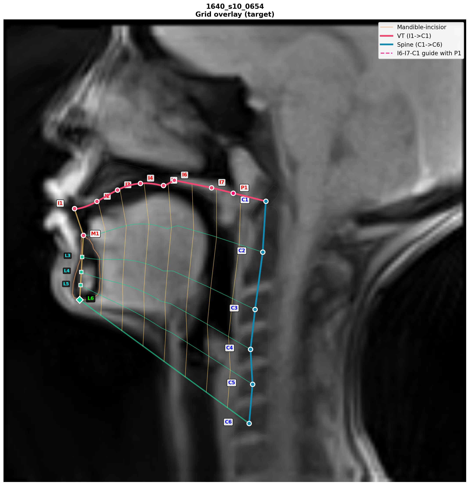
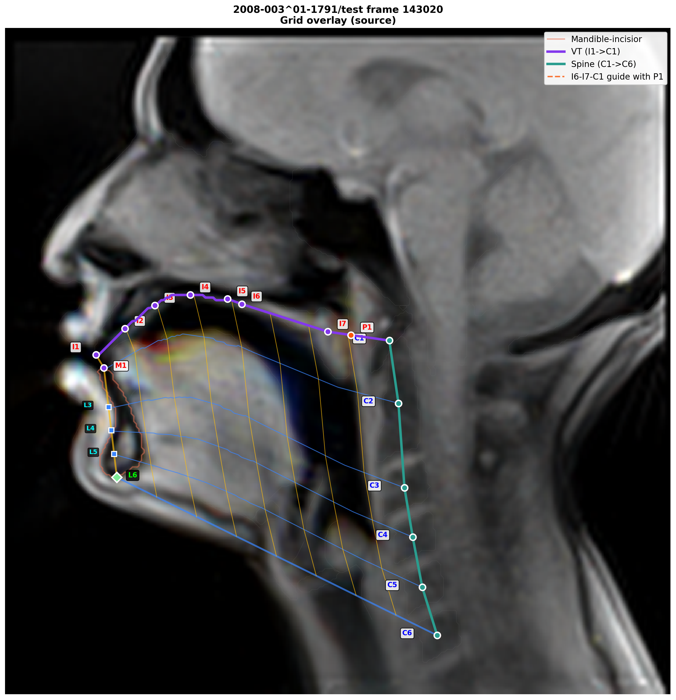
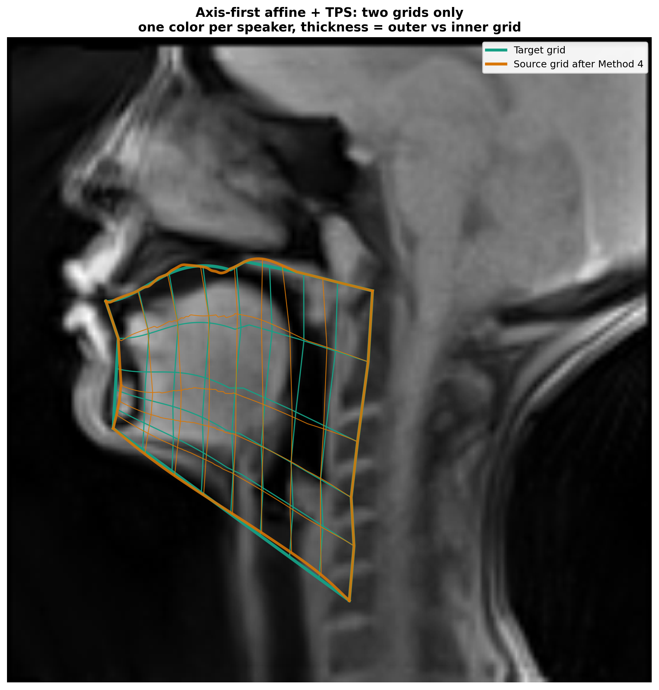
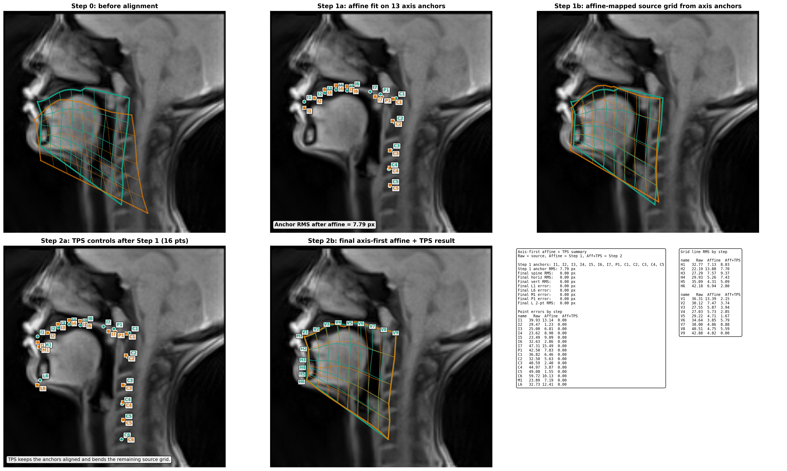
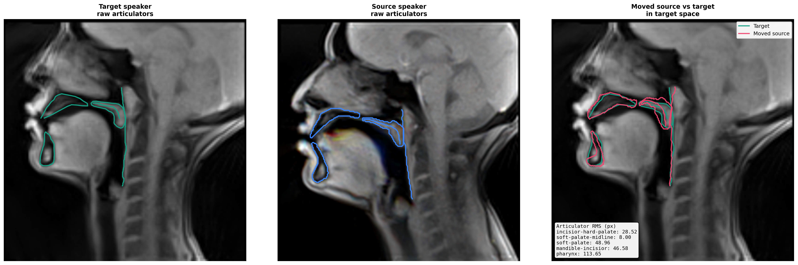

# Grid Transform

Lightweight experiments for building a vocal-tract grid, aligning two speakers with `Affine + TPS`, and warping articulators or the full source speaker into target space.

## What This Repo Contains

- `create_speaker_grid.py`
  - Build and visualize the anatomical grid for one speaker.
- `method4_transform.py`
  - Two-step alignment:
    - Step 1: affine on axis landmarks
    - Step 2: TPS refinement
- `move_target_articulators.py`
  - Move shared articulator contours between speakers for comparison.
- `warp_source_speaker_to_target.py`
  - Warp the full source speaker image into target space.

## Main Idea

1. Build anatomical grids for the target and source speakers.
2. Fit an affine transform on the main horizontal and vertical landmark axes.
3. Refine the alignment with TPS on the post-affine landmarks.
4. Apply the final transform to grid lines, articulators, or the whole source image.

## How The Grid Is Built

The grid is anatomical, not just evenly spaced image lines.

1. Find the main landmark curves.
   - `incisior-hard-palate` gives the front and top vocal-tract contour.
   - `soft-palate-midline` gives the posterior top contour.
   - `c1..c6` give the cervical spine centers.
   - `mandible-incisior` gives the lower jaw landmarks.
   - `pharynx` is used to locate the posterior intersection point.

2. Build the top reference path of the tract.
   - `I1..I5` are sampled along the hard-palate contour.
   - `I6` is the first point of `soft-palate-midline`.
   - `I7` is the selected soft-palate anchor used to stabilize the posterior top axis.
   - `C1` is the first cervical center.
   - The top path is then assembled as `I1 -> ... -> I5 -> I6 -> I7 -> C1`.

3. Build the lower and posterior anchors.
   - `M1` is the highest point on `mandible-incisior`.
   - `L6` is the lowest point on `mandible-incisior`.
   - `C1..C6` are the centroids of the spine contours.
   - `P1` is the pharynx intersection on the posterior segment near `I7 -> C1`.

4. Turn the anatomical paths into a grid.
   - Horizontal line `H1` follows the top vocal-tract path.
   - `H2` starts at `M1` and ends at `C2`.
   - `H3..H5` are interpolated between the jaw side and the spine.
   - `H6` goes from `L6` to `C6`.
   - Vertical lines `V1..V9` are built by connecting corresponding samples across all horizontal lines.

## Landmark Summary

- `I1..I5`
  - Equally spaced anchors on the hard-palate contour from anterior to posterior.
- `I6`
  - Start of the soft-palate midline.
- `I7`
  - Posterior soft-palate anchor used to control the bend before the path reaches `C1`.
- `C1..C6`
  - Cervical vertebra centroids defining the spine axis.
- `M1`
  - Upper jaw-side anchor from `mandible-incisior`.
- `L6`
  - Lower jaw-side anchor from `mandible-incisior`.
- `P1`
  - Posterior intersection with the pharynx used for alignment diagnostics and posterior geometry.

## Why These Landmarks Matter

- The `I` points stabilize the top vocal-tract shape.
- The `C` points stabilize the posterior spine axis.
- `M1` and `L6` stabilize the jaw-side boundary.
- `P1` helps connect the posterior tract geometry to the pharyngeal wall.

Together, these landmarks make the grid anatomically meaningful enough to compare two speakers and to drive the affine-plus-TPS transform.

## Quick Run

```powershell
.\.venv\Scripts\pip install -r requirements.txt
.\.venv\Scripts\python create_speaker_grid.py --source vtnl --speaker 1640_s10_0654
.\.venv\Scripts\python method4_transform.py
.\.venv\Scripts\python move_target_articulators.py
.\.venv\Scripts\python warp_source_speaker_to_target.py
```

## Visual Results

### Target Grid



### Source Grid



### Method 4: Two-Step Alignment





### Source Articulators Moved Into Target Space



### Full Source Speaker Warped Into Target Space


## Notes

- Current default setup uses:
  - Target: `1640_s10_0654` from `VTNL/`
  - Source: frame `143020` from `vocal-tract-seg/`
- The code is organized for fast experimentation, visualization, and comparison rather than packaging.
